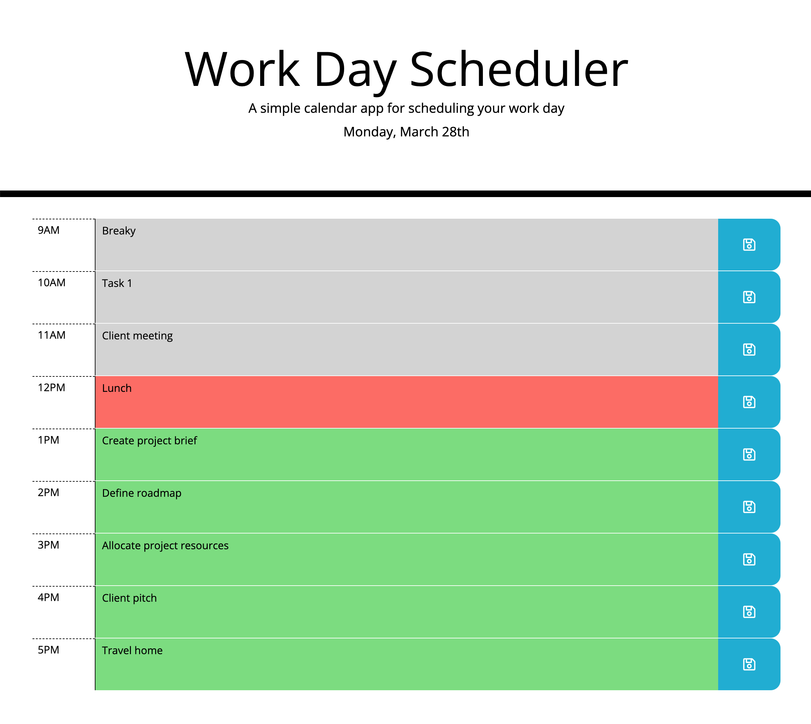
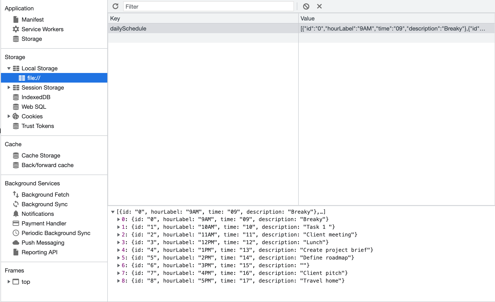

# WEEK 5 Assignment - Daily Planner
In this weeks task we were required to build a daily planner that allowed users to save their daily task over the hours of a standard work day. As the time progressed through the day, the elements styling changes the colours signify current tasks and then past and future.

## Notes 
This assignment introduced me to a lot of new shorthand methods. It was good to find examples of these shorthands and research how they worked and then test them in this planner.

## Questions/Challenges

## Project Links

* Repo name

sjb-daily-planner

* Live site

https://simmmmo.github.io/sjb-daily-planner/

* GitHub enviroment

https://github.com/simmmmo/sjb-daily-planner.git

git@github.com:simmmmo/sjb-daily-planner.git

* Screenshots

